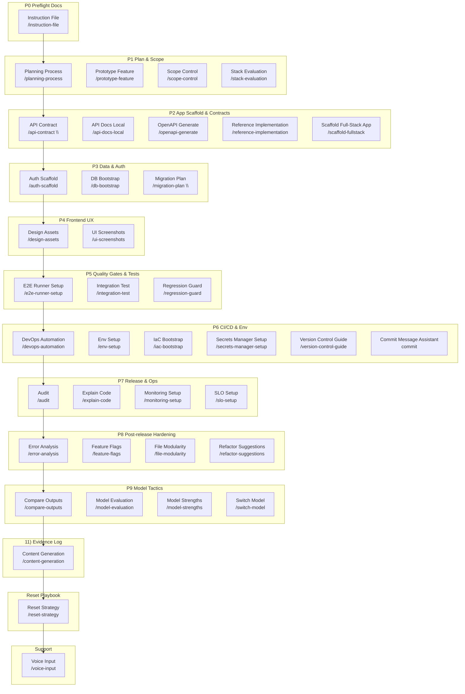

# Codex Prompts — Vibe Coding Additions

This pack extends the default Codex CLI prompts with vibe-coding playbooks inspired by YC cadences. Drop the folder into `~/.codex/prompts` and you get a catalog of opinionated helpers covering planning, scope control, testing, audits, and model orchestration.

## Installation

1. Clone or copy this repository into `~/.codex/prompts`. The CLI hot-reloads changes, but restarting Codex guarantees the new commands are registered.
2. Optionally commit the directory into your dotfiles so the prompts travel with your workstation setup.

## Using these prompts

- **Direct slash commands**: Invoke the files that declare a `Trigger:` (table below) straight from Codex. Example: `/planning-process Add OAuth login` opens `planning-process.md` and walks through the feature plan template.
- **Gemini mapper prompt**: `/gemini-map` is a single translator prompt (`gemini-map.md`) that converts Gemini CLI TOML commands into Codex prompt files. Use it only when migrating Gemini content; all other prompts run directly with their own slash commands.

## Prompt metadata

Every lifecycle prompt starts with YAML front matter so docs and tooling stay in sync:

```yaml
---
phase: "P5 Quality Gates & Tests"
gate: "Test Gate"
status: "Runner green locally and wired into CI before expanding coverage."
previous:
  - "/auth-scaffold"
  - "/ui-screenshots"
next:
  - "/integration-test"
  - "/coverage-guide"
---
```

- `phase` — primary stage(s) from [WORKFLOW.md](WORKFLOW.md). Use a string for a single phase or a YAML list for cross-phase helpers.
- `gate` — named gate or checkpoint the prompt supports.
- `status` — the success criteria required to pass that gate.
- `previous` — prerequisite prompts or setup tasks.
- `next` — recommended follow-up prompts once the gate clears.

Maintainers and the metadata validator rely on this block to keep the stage catalog coherent.

## Core slash commands

Commands are grouped by development phase. Stage headings link back to
[WORKFLOW.md](WORKFLOW.md) for owners, gates, and evidence expectations.

<!-- The section below is generated by `npm run build:catalog`. -->
<!-- prompts-catalog:start -->

### [P0 Preflight Docs](WORKFLOW.md#p0-preflight-docs-blocking)

| Command | Gate | Purpose |
| --- | --- | --- |
| `/instruction-file` | DocFetchReport | Generate or update `cursor.rules`, `windsurf.rules`, or `claude.md` with project-specific instructions. |

### [P1 Plan & Scope](WORKFLOW.md#p1-plan-scope)

| Command | Gate | Purpose |
| --- | --- | --- |
| `/planning-process` | Scope Gate | Draft, refine, and execute a feature plan with strict scope control and progress tracking. |
| `/prototype-feature` | Prototype review | Spin up a standalone prototype in a clean repo before merging into main. |
| `/scope-control` | Scope Gate | Enforce explicit scope boundaries and maintain "won't do" and "ideas for later" lists. |
| `/stack-evaluation` | Scope Gate | Evaluate language/framework choices relative to AI familiarity and repo goals. |

### [P2 App Scaffold & Contracts](WORKFLOW.md#p2-app-scaffold-contracts)

| Command | Gate | Purpose |
| --- | --- | --- |
| `/api-contract "<feature or domain>"` | Test Gate lite | Author an initial OpenAPI 3.1 or GraphQL SDL contract from requirements. |
| `/api-docs-local` | Test Gate lite | Fetch API docs and store locally for offline, deterministic reference. |
| `/openapi-generate <server\|client> <lang> <spec-path>` | Test Gate lite | Generate server stubs or typed clients from an OpenAPI spec. |
| `/reference-implementation` | Test Gate lite | Mimic the style and API of a known working example. |
| `/scaffold-fullstack <stack>` | Test Gate lite | Create a minimal, production‑ready monorepo template with app, API, tests, CI seeds, and infra stubs. |

### [P3 Data & Auth](WORKFLOW.md#p3-data-auth)

| Command | Gate | Purpose |
| --- | --- | --- |
| `/auth-scaffold <oauth\|email\|oidc>` | Migration dry-run | Scaffold auth flows, routes, storage, and a basic threat model. |
| `/db-bootstrap <postgres\|mysql\|sqlite\|mongodb>` | Migration dry-run | Pick a database, initialize migrations, local compose, and seed scripts. |
| `/migration-plan "<change summary>"` | Migration dry-run | Produce safe up/down migration steps with checks and rollback notes. |

### [P4 Frontend UX](WORKFLOW.md#p4-frontend-ux)

| Command | Gate | Purpose |
| --- | --- | --- |
| `/design-assets` | Accessibility checks queued | Generate favicons and small design snippets from product brand. |
| `/ui-screenshots` | Accessibility checks queued | Analyze screenshots for UI bugs or inspiration and propose actionable UI changes. |

### [P5 Quality Gates & Tests](WORKFLOW.md#p5-quality-gates-tests)

| Command | Gate | Purpose |
| --- | --- | --- |
| `/e2e-runner-setup <playwright\|cypress>` | Test Gate | Configure an end‑to‑end test runner with fixtures and data sandbox. |
| `/integration-test` | Test Gate | Generate E2E tests that simulate real user flows. |
| `/regression-guard` | Test Gate | Detect unrelated changes and add tests to prevent regressions. |

### [P6 CI/CD & Env](WORKFLOW.md#p6-cicd-env)

| Command | Gate | Purpose |
| --- | --- | --- |
| `/devops-automation` | Review Gate | Configure servers, DNS, SSL, CI/CD at a pragmatic level. |
| `/env-setup` | Review Gate | Create `.env.example`, runtime schema validation, and per‑env overrides. |
| `/iac-bootstrap <aws\|gcp\|azure\|fly\|render>` | Review Gate | Create minimal Infrastructure‑as‑Code for chosen platform plus CI pipeline hooks. |
| `/secrets-manager-setup <provider>` | Review Gate | Provision secret store and map app variables to it. |
| `/version-control-guide` | Review Gate | Enforce clean incremental commits and clean-room re-implementation when finalizing. |
| `commit` | Review Gate | Generate a conventional, review-ready commit message from the currently staged changes. |

### [P7 Release & Ops](WORKFLOW.md#p7-release-ops)

| Command | Gate | Purpose |
| --- | --- | --- |
| `/audit` | Release Gate | Audit repository hygiene and suggest improvements. |
| `/explain-code` | Review Gate | Provide line-by-line explanations for a given file or diff. |
| `/monitoring-setup` | Release Gate | Bootstrap logs, metrics, and traces with dashboards per domain. |
| `/slo-setup` | Release Gate | Define Service Level Objectives, burn alerts, and runbooks. |

### [P8 Post-release Hardening](WORKFLOW.md#p8-post-release-hardening)

| Command | Gate | Purpose |
| --- | --- | --- |
| `/error-analysis` | Post-release cleanup | Analyze error logs and enumerate likely root causes with fixes. |
| `/feature-flags <provider>` | Post-release cleanup | Integrate a flag provider, wire SDK, and enforce guardrails. |
| `/file-modularity` | Post-release cleanup | Enforce smaller files and propose safe splits for giant files. |
| `/refactor-suggestions` | Post-release cleanup | Propose repo-wide refactoring opportunities after tests exist. |

### [P9 Model Tactics](WORKFLOW.md#p9-model-tactics-cross-cutting)

| Command | Gate | Purpose |
| --- | --- | --- |
| `/compare-outputs` | Model uplift | Run multiple models or tools on the same prompt and summarize best output. |
| `/model-evaluation` | Model uplift | Try a new model and compare outputs against a baseline. |
| `/model-strengths` | Model uplift | Choose model per task type. |
| `/switch-model` | Model uplift | Decide when to try a different AI backend and how to compare. |

### [11) Evidence Log](WORKFLOW.md#11-evidence-log)

| Command | Gate | Purpose |
| --- | --- | --- |
| `/content-generation` | Evidence Log | Draft docs, blog posts, or marketing copy aligned with the codebase. |

### [Reset Playbook](WORKFLOW.md#reset-playbook)

| Command | Gate | Purpose |
| --- | --- | --- |
| `/reset-strategy` | Clean restart | Decide when to hard reset and start clean to avoid layered bad diffs. |

### [Support](WORKFLOW.md#support)

| Command | Gate | Purpose |
| --- | --- | --- |
| `/voice-input` | Support intake | Support interaction from voice capture and convert to structured prompts. |
<!-- prompts-catalog:end -->

## Reference assets

- `workflow.mmd` — Mermaid source for the end-to-end workflow shown below.

## Maintaining the catalog

- `npm run build:catalog` validates metadata and rebuilds `catalog.json`, the README tables, and `workflow.mmd`.
- A Husky pre-commit hook runs the command automatically and stages generated artifacts.
- Rerun the command manually after resolving merge conflicts or skipping hooks so the repo stays in sync.
- To bypass the hook temporarily, run `HUSKY=0 git commit ...` and rebuild before pushing to keep CI green.

- `codefetch/codebase.md` — Quick peek of local config snippets used by the prompts (e.g., markdownlint defaults).

## Example flow

1. `/planning-process Add OAuth login` to align on goals, risks, and validation.
2. Implement the scoped tasks, checking `/scope-control` to document non-goals and later ideas.
3. `/integration-test` to add coverage for the new flow, then `/regression-guard` to verify no unrelated files drifted.
4. `/version-control-guide` to clean the final diff, followed by `/pr-desc` or `/release-notes` to communicate the change.

## Mermaid flowchart

<!-- workflow-diagram:start -->

<!-- workflow-diagram:end -->


## Future enhancements

We plan to evolve this prompt pack into a full MCP server so teams can integrate Codex-native workflows through a single machine-coordination endpoint. Detailed architectural and rollout plans are forthcoming, but anticipated capabilities include:

- Hosting the current prompt catalog as callable MCP tools with typed inputs and outputs.
- Surfacing DocFetch and gating status signals as first-class MCP events.
- Enabling external automation to trigger prompt flows programmatically while preserving safety gates.
