# Codex Prompts — Vibe Coding Additions

This pack extends the default Codex CLI prompts with vibe-coding playbooks inspired by YC cadences. Drop the folder into `~/.codex/prompts` and you get a catalog of opinionated helpers covering planning, scope control, testing, audits, and model orchestration.

## Installation

1. Clone or copy this repository into `~/.codex/prompts`. The CLI hot-reloads changes, but restarting Codex guarantees the new commands are registered.
2. Optionally commit the directory into your dotfiles so the prompts travel with your workstation setup.

## Using these prompts

- **Direct slash commands**: Invoke the files that declare a `Trigger:` (table below) straight from Codex. Example: `/planning-process Add OAuth login` opens `planning-process.md` and walks through the feature plan template.
- **Gemini→Codex Mapper templates**: Files with front matter call into the unified `/gemini-map` command. Run `/gemini-map <template> <args>` (e.g. `/gemini-map audit`) to execute the specific flow described in that template. Templates expect the repo context described in their numbered steps.

## Core slash commands

| Command | File | What it does |
| --- | --- | --- |
| /api-docs-local | api-docs-local.md | Fetch API docs and store locally for offline, deterministic reference. |
| /compare-outputs | compare-outputs.md | Run multiple models or tools on the same prompt and summarize the best output. |
| /content-generation | content-generation.md | Draft docs, blog posts, or marketing copy aligned with the codebase. |
| /design-assets | design-assets.md | Generate favicons and lightweight visual assets from your product brand. |
| /devops-automation | devops-automation.md | Configure servers, DNS, SSL, and CI/CD with pragmatic defaults. |
| /error-analysis | error-analysis.md | Analyze error logs and enumerate likely root causes with fixes. |
| /explain-code | explain-code.md | Provide line-by-line explanations for a given file or diff. |
| /file-modularity | file-modularity.md | Enforce smaller files and propose safe splits for giant files. |
| /instruction-file | instruction-file.md | Generate or update `cursor.rules`, `windsurf.rules`, or `claude.md` with project-specific guidance. |
| /integration-test | integration-test.md | Generate end-to-end tests that simulate real user flows. |
| /logging-strategy | logging-strategy.md | Add or remove diagnostic logging with structured levels and privacy considerations. |
| /model-evaluation | model-evaluation.md | Try a new model and compare outputs against a baseline. |
| /model-strengths | model-strengths.md | Route work by model strengths for faster delegation. |
| /modular-architecture | modular-architecture.md | Enforce module boundaries and external interfaces. |
| /planning-process | planning-process.md | Draft, refine, and execute a feature plan with strict scope control. |
| /prototype-feature | prototype-feature.md | Spin up a standalone prototype in a clean repo before merging into main. |
| /refactor-suggestions | refactor-suggestions.md | Propose repo-wide refactoring opportunities once tests exist. |
| /reference-implementation | reference-implementation.md | Mimic the style and API of a known working example. |
| /regression-guard | regression-guard.md | Detect unrelated changes and add tests to prevent regressions. |
| /reset-strategy | reset-strategy.md | Decide when to hard reset and start clean to avoid layered bad diffs. |
| /scope-control | scope-control.md | Enforce explicit scope boundaries plus “won’t do” and “ideas for later” lists. |
| /stack-evaluation | stack-evaluation.md | Evaluate language/framework choices relative to AI familiarity and roadmap goals. |
| /switch-model | switch-model.md | Decide when to try a different AI backend and how to compare. |
| /ui-screenshots | ui-screenshots.md | Analyze screenshots for UI bugs or inspiration and propose actionable fixes. |
| /version-control-guide | version-control-guide.md | Enforce clean incremental commits and clean-room re-implementation before merge. |
| /voice-input | voice-input.md | Convert speech to structured prompts for Codex. |

## Gemini→Codex Mapper templates (`/gemini-map`)

Each template below is invoked through `/gemini-map`. Supply any arguments requested in the numbered steps within the file (for example, a target path, test output, or error description). They are grouped here so you can quickly locate the right helper.

### Architecture, planning, and lint configuration

- `action-diagram.md` — Explain workflow triggers and dependencies so diagramming tools have ready-made nodes and edges.
- `adr-new.md` — Draft an Architecture Decision Record with context, options, and consequences.
- `plan.md` — Plan a Prettier adoption or formatting migration with minimal churn.
- `refactor-file.md` — Suggest targeted refactors for a single file, including rationale.
- `eslint-review.md` — Review ESLint configuration and suggest rule tweaks.
- `tsconfig-review.md` — Review `tsconfig.json` for correctness and developer experience.

### Implementation and debugging accelerators

- `api-usage.md` — Show how an internal API is defined and consumed across the repo.
- `explain-symbol.md` — Trace where a symbol lives, who calls it, and how to extend it safely.
- `grep.md` — Run curated ripgrep/grep queries for text discovery.
- `generate.md` — Produce unit tests for a given source file with arrange/act/assert structure.
- `fix.md` — Propose a minimal, correct fix with unified diff hunks.
- `explain-failures.md` — Analyze failing tests, list suspected causes, and outline next steps.

### Review, ownership, and release support

- `blame-summary.md` — Summarize authorship hotspots and likely reviewers from `git blame`.
- `changed-files.md` — Summarize changed files between `HEAD` and `origin/main`.
- `cleanup-branches.md` — Recommend local branches that are merged or stale and safe to delete.
- `commit.md` — Generate a commit message from staged changes.
- `owners.md` — Suggest owners and reviewers for a path using CODEOWNERS and history.
- `pr-desc.md` — Draft a PR description from the current branch diff.
- `review.md` — Review code matching a pattern and provide actionable feedback.
- `review-branch.md` — Provide a high-level review of the branch compared to `origin/main`.
- `release-notes.md` — Convert recent commits into human-readable release notes.
- `version-proposal.md` — Propose the next semantic version based on commit history.

### Quality, hygiene, and compliance

- `audit.md` — Audit repository hygiene (docs, tests, CI, security) and suggest improvements.
- `check.md` — Check adherence to `.editorconfig` across the repo.
- `coverage-guide.md` — Suggest a plan to raise test coverage where the suite is thin.
- `dead-code-scan.md` — Flag likely dead files and exports using static signals.
- `license-report.md` — Summarize third-party licenses and highlight risk flags.
- `secrets-scan.md` — Review secret-scan output and separate true leaks from noise.
- `summary.md` — Produce a README-level summary of the repository.
- `todo-report.md` — Summarize TODO/FIXME/XXX annotations across the codebase.
- `todos.md` — Group TODO/FIXME annotations with owners or themes.

## Reference assets

- `workflow.mmd` — Mermaid source for the end-to-end workflow shown below.
- `codefetch/codebase.md` — Quick peek of local config snippets used by the prompts (e.g., markdownlint defaults).

## Example flow

1. `/planning-process Add OAuth login` to align on goals, risks, and validation.
2. Implement the scoped tasks, checking `/scope-control` to document non-goals and later ideas.
3. `/integration-test` to add coverage for the new flow, then `/regression-guard` to verify no unrelated files drifted.
4. `/version-control-guide` to clean the final diff, followed by `/pr-desc` or `/release-notes` via `/gemini-map` for communication.

## Mermaid flowchart

```mermaid
flowchart TD
    A[planning-process.md] --> B[scope-control.md]
    B --> C[prototype-feature.md]
    C --> D[explain-code.md]
    D --> E[refactor-file.md]
    E --> F[file-modularity.md]
    F --> G[generate.md]
    G --> H[integration-test.md]
    H --> I[coverage-guide.md]
    I --> J[explain-failures.md]
    J --> K[fix.md]
    K --> L[commit.md]
    L --> M[review.md]
    M --> N[review-branch.md]
    N --> O[pr-desc.md]
    O --> P[regression-guard.md]
    P --> Q[release-notes.md]
    Q --> R[version-proposal.md]
    R --> S[devops-automation.md]
    S --> T[reset-strategy.md]
    T --> U[cleanup-branches.md]
    U --> V[design-assets.md]
    V --> W[ui-screenshots.md]
    W --> X[logging-strategy.md]
    X --> Y[error-analysis.md]
    Y --> Z[audit.md]
    Z --> AA[summary.md]
    AA --> AB[instruction-file.md]
    AB --> AC[version-control-guide.md]
    AC --> AD[owners.md]
    AD --> AE[blame-summary.md]
    AE --> AF[changed-files.md]
    AF --> AG[todo-report.md]
    AG --> AH[todos.md]
    AH --> AI[dead-code-scan.md]
    AI --> AJ[grep.md]
    AJ --> AK[explain-symbol.md]
    AK --> AL[api-usage.md]
    AL --> AM[action-diagram.md]
    AM --> AN[plan.md]
    AN --> AO[tsconfig-review.md]
    AO --> AP[eslint-review.md]
    AP --> AQ[stack-evaluation.md]
    AQ --> AR[modular-architecture.md]
    AR --> AS[refactor-suggestions.md]
    AS --> AT[reference-implementation.md]
    AT --> AU[model-strengths.md]
    AU --> AV[model-evaluation.md]
    AV --> AW[compare-outputs.md]
    AW --> AX[switch-model.md]
    AX --> AY[voice-input.md]
    AY --> AZ[content-generation.md]
    AZ --> BA[api-docs-local.md]
```

