# Codex Prompts — Vibe Coding Additions

Just clone into your .codex/ directory and all of the following slash commands will be added.

These prompts complement existing Codex files and map to vibe-coding practices from YC notes.

## Triggers

- /planning-process — plan features with scope control.
- /scope-control — enforce non-goals and later ideas.
- /reset-strategy — clean resets when stuck.
- /version-control-guide — clean final diffs.
- /integration-test — generate E2E tests.
- /regression-guard — guard against unrelated changes.
- /error-analysis — analyze errors and fixes.
- /logging-strategy — structured logging plan.
- /switch-model — try a different AI backend.
- /instruction-file — update Cursor/Windsurf rules.
- /api-docs-local — store API docs locally.
- /compare-outputs — run multiple models and pick best.
- /prototype-feature — standalone spike in clean repo.
- /reference-implementation — mimic a working example.
- /modular-architecture — enforce module boundaries.
- /stack-evaluation — stack tradeoff analysis.
- /file-modularity — split giant files safely.
- /devops-automation — infra and CI templates.
- /design-assets — favicon and visuals.
- /content-generation — docs/blog copy.
- /explain-code — line-by-line explanation.
- /ui-screenshots — visual QA and fixes.
- /voice-input — convert speech to commands.
- /refactor-suggestions — repo-wide refactors.
- /model-evaluation — adopt new model or not.
- /model-strengths — route tasks by model.

## Example flow

1. `/planning-process Add OAuth login`
2. Implement tasks.
3. `/integration-test` to add flows.
4. `/regression-guard` before merge.
5. `/version-control-guide` to finalize clean diff.

## Mermaid flowchart

```mermaid
flowchart TD
    A[planning-process.md] --> B[scope-control.md]
    B --> C[prototype-feature.md]
    C --> D[explain-code.md]
    D --> E[refactor-file.md]
    E --> F[file-modularity.md]
    F --> G[generate.md]
    G --> H[integration-test.md]
    H --> I[coverage-guide.md]
    I --> J[explain-failures.md]
    J --> K[fix.md]
    K --> L[commit.md]
    L --> M[review.md]
    M --> N[review-branch.md]
    N --> O[pr-desc.md]
    O --> P[regression-guard.md]
    P --> Q[release-notes.md]
    Q --> R[version-proposal.md]
    R --> S[devops-automation.md]
    S --> T[reset-strategy.md]
    T --> U[cleanup-branches.md]
    U --> V[design-assets.md]
    V --> W[ui-screenshots.md]
    W --> X[logging-strategy.md]
    X --> Y[error-analysis.md]
    Y --> Z[audit.md]
    Z --> AA[summary.md]
    AA --> AB[instruction-file.md]
    AB --> AC[version-control-guide.md]
    AC --> AD[owners.md]
    AD --> AE[blame-summary.md]
    AE --> AF[changed-files.md]
    AF --> AG[todo-report.md]
    AG --> AH[todos.md]
    AH --> AI[dead-code-scan.md]
    AI --> AJ[grep.md]
    AJ --> AK[explain-symbol.md]
    AK --> AL[api-usage.md]
    AL --> AM[action-diagram.md]
    AM --> AN[plan.md]
    AN --> AO[tsconfig-review.md]
    AO --> AP[eslint-review.md]
    AP --> AQ[stack-evaluation.md]
    AQ --> AR[modular-architecture.md]
    AR --> AS[refactor-suggestions.md]
    AS --> AT[reference-implementation.md]
    AT --> AU[model-strengths.md]
    AU --> AV[model-evaluation.md]
    AV --> AW[compare-outputs.md]
    AW --> AX[switch-model.md]
    AX --> AY[voice-input.md]
    AY --> AZ[content-generation.md]
    AZ --> BA[api-docs-local.md]
```

