# Codex Prompts — Vibe Coding Additions

This pack extends the default Codex CLI prompts with vibe-coding playbooks inspired by YC cadences. Drop the folder into `~/.codex/prompts` and you get a catalog of opinionated helpers covering planning, scope control, testing, audits, and model orchestration.

## Installation

1. Clone or copy this repository into `~/.codex/prompts`. The CLI hot-reloads changes, but restarting Codex guarantees the new commands are registered.
2. Optionally commit the directory into your dotfiles so the prompts travel with your workstation setup.

## Contributor workflow

Run these commands whenever you add or edit prompts so the generated catalog stays in sync:

1. `npm install` — install the TypeScript tooling used by the validation scripts.
2. `npm run validate:metadata` — confirm every prompt’s front matter matches the lifecycle workflow.
3. `npm run build:catalog` — regenerate `catalog.json` and refresh the README tables.

`npm run build:catalog` must run after each prompt change; it keeps our published metadata accurate for the upcoming [MCP roadmap](#future-enhancements) work on tool exposure and state tracking. The pre-commit hook and CI guard execute these checks and will fail when `catalog.json` or the README tables are stale, so expect local or remote failures if the command is skipped.

## Using these prompts

- **Direct slash commands**: Invoke the files that declare a `Trigger:` (table below) straight from Codex. Example: `/planning-process Add OAuth login` opens `planning-process.md` and walks through the feature plan template.
- **Gemini mapper prompt**: `/gemini-map` is a single translator prompt (`gemini-map.md`) that converts Gemini CLI TOML commands into Codex prompt files. Use it only when migrating Gemini content; all other prompts run directly with their own slash commands.

## Prompt metadata

Every lifecycle prompt starts with YAML front matter so docs and tooling stay in sync:

```yaml
---
phase: "P5 Quality Gates & Tests"
gate: "Test Gate"
status: "Runner green locally and wired into CI before expanding coverage."
previous:
  - "/auth-scaffold"
  - "/ui-screenshots"
next:
  - "/integration-test"
  - "/coverage-guide"
---
```

- `phase` — primary stage(s) from [WORKFLOW.md](WORKFLOW.md). Use a string for a single phase or a YAML list for cross-phase helpers.
- `gate` — named gate or checkpoint the prompt supports.
- `status` — the success criteria required to pass that gate.
- `previous` — prerequisite prompts or setup tasks.
- `next` — recommended follow-up prompts once the gate clears.

Maintainers and the metadata validator rely on this block to keep the stage catalog coherent.

## Core slash commands

Commands are grouped by development phase. Stage headings link back to
[WORKFLOW.md](WORKFLOW.md) for owners, gates, and evidence expectations.

### [P0 Preflight Docs](WORKFLOW.md#p0-preflight-docs-blocking) — DocFetchReport must be **OK**

| Command | What it does |
| --- | --- |
| /instruction-file | Generate or update `cursor.rules`, `windsurf.rules`, or `claude.md` with project-specific instructions. |

### [P1 Plan & Scope](WORKFLOW.md#p1-plan--scope) — pass the [Scope Gate](WORKFLOW.md#scope-gate)

| Command | What it does |
| --- | --- |
| /planning-process | Draft, refine, and execute a feature plan with strict scope control and progress tracking. |
| /prototype-feature | Spin up a standalone prototype in a clean repo before merging into main. |
| /scope-control | Enforce explicit scope boundaries and maintain "won't do" and "ideas for later" lists. |
| /stack-evaluation | Evaluate language/framework choices relative to AI familiarity and repo goals. |

### [P2 App Scaffold & Contracts](WORKFLOW.md#p2-app-scaffold--contracts) — clear Test Gate lite

| Command | What it does |
| --- | --- |
| /api-contract "<feature or domain>" | Author an initial OpenAPI 3.1 or GraphQL SDL contract from requirements. |
| /api-docs-local | Fetch API docs and store locally for offline, deterministic reference. |
| /openapi-generate <server\|client> <lang> <spec-path> | Generate server stubs or typed clients from an OpenAPI spec. |
| /prototype-feature | Spin up a standalone prototype in a clean repo before merging into main. |
| /reference-implementation | Mimic the style and API of a known working example. |
| /scaffold-fullstack <stack> | Create a minimal, production-ready monorepo template with app, API, tests, CI seeds, and infra stubs. |

### [P3 Data & Auth](WORKFLOW.md#p3-data--auth) — migrations must dry-run cleanly

| Command | What it does |
| --- | --- |
| /auth-scaffold <oauth\|email\|oidc> | Scaffold auth flows, routes, storage, and a basic threat model. |
| /db-bootstrap <postgres\|mysql\|sqlite\|mongodb> | Pick a database, initialize migrations, local compose, and seed scripts. |
| /migration-plan "<change summary>" | Produce safe up/down migration steps with checks and rollback notes. |

### [P4 Frontend UX](WORKFLOW.md#p4-frontend-ux) — queue accessibility checks

| Command | What it does |
| --- | --- |
| /design-assets | Generate favicons and small design snippets from product brand. |
| /ui-screenshots | Analyze screenshots for UI bugs or inspiration and propose actionable UI changes. |

### [P5 Quality Gates & Tests](WORKFLOW.md#p5-quality-gates--tests) — meet the [Test Gate](WORKFLOW.md#test-gate)

| Command | What it does |
| --- | --- |
| /coverage-guide | Propose high-ROI tests to raise coverage using uncovered areas. |
| /e2e-runner-setup <playwright\|cypress> | Configure an end-to-end test runner with fixtures and a data sandbox. |
| /generate <source-file> | Generate unit tests for a given source file. |
| /integration-test | Generate E2E tests that simulate real user flows. |
| /regression-guard | Detect unrelated changes and add tests to prevent regressions. |

### [P6 CI/CD & Env](WORKFLOW.md#p6-cicd--env) — satisfy the [Review Gate](WORKFLOW.md#review-gate)

| Command | What it does |
| --- | --- |
| /devops-automation | Configure servers, DNS, SSL, CI/CD at a pragmatic level. |
| /env-setup | Create .env.example, runtime schema validation, and per-env overrides. |
| /iac-bootstrap <aws\|gcp\|azure\|fly\|render> | Create minimal Infrastructure-as-Code for the chosen platform plus CI hooks. |
| /secrets-manager-setup <provider> | Provision a secrets store and map application variables to it. |
| /version-control-guide | Enforce clean incremental commits and clean-room re-implementation when finalizing. |
| commit | Generate a conventional, review-ready commit message from the currently staged changes. |

### [P7 Release & Ops](WORKFLOW.md#p7-release--ops) — clear the [Release Gate](WORKFLOW.md#release-gate)

| Command | What it does |
| --- | --- |
| /audit | Audit repository hygiene and suggest improvements. |
| /explain-code | Provide line-by-line explanations for a given file or diff. |
| /monitoring-setup | Bootstrap logs, metrics, and traces with dashboards per domain. |
| /owners <path> | Suggest likely owners or reviewers for the specified path. |
| /pr-desc <context> | Draft a PR description from the branch diff. |
| /release-notes <git-range> | Generate human-readable release notes from recent commits. |
| /review <pattern> | Review code matching a pattern and deliver actionable feedback. |
| /review-branch | Provide a high-level review of the current branch versus origin/main. |
| /slo-setup | Define Service Level Objectives, burn alerts, and runbooks. |
| /version-proposal | Propose the next semantic version based on commit history. |

### [P8 Post-release Hardening](WORKFLOW.md#p8-post-release-hardening) — resolve Sev-1 issues

| Command | What it does |
| --- | --- |
| /cleanup-branches | Recommend which local branches are safe to delete and which to keep. |
| /dead-code-scan | Identify likely dead or unused files and exports using static signals. |
| /error-analysis | Analyze error logs and enumerate likely root causes with fixes. |
| /feature-flags <provider> | Integrate a flag provider, wire the SDK, and enforce guardrails. |
| /file-modularity | Enforce smaller files and propose safe splits for giant files. |
| /fix "<bug summary>" | Propose a minimal, correct fix with diff-style patches. |
| /refactor-suggestions | Propose repo-wide refactoring opportunities after tests exist. |

### [P9 Model Tactics](WORKFLOW.md#p9-model-tactics-cross-cutting) — document uplift before switching defaults

| Command | What it does |
| --- | --- |
| /compare-outputs | Run multiple models or tools on the same prompt and summarize best output. |
| /model-evaluation | Try a new model and compare outputs against a baseline. |
| /model-strengths | Choose model per task type. |
| /switch-model | Decide when to try a different AI backend and how to compare. |

### [Reset Playbook](WORKFLOW.md#reset-playbook) and other cross-cutting helpers

| Command | Stage tie-in | What it does |
| --- | --- | --- |
| /content-generation | 11) Evidence Log | Draft docs, blog posts, or marketing copy aligned with the codebase. |
| /reset-strategy | Reset Playbook | Decide when to hard reset and start clean to avoid layered bad diffs. |
| /voice-input | Support | Support interaction from voice capture and convert to structured prompts. |

## Reference assets

- `workflow.mmd` — Mermaid source for the end-to-end workflow shown below.
- `codefetch/codebase.md` — Quick peek of local config snippets used by the prompts (e.g., markdownlint defaults).

## Example flow

1. `/planning-process Add OAuth login` to align on goals, risks, and validation.
2. Implement the scoped tasks, checking `/scope-control` to document non-goals and later ideas.
3. `/integration-test` to add coverage for the new flow, then `/regression-guard` to verify no unrelated files drifted.
4. `/version-control-guide` to clean the final diff, followed by `/pr-desc` or `/release-notes` to communicate the change.

## Mermaid flowchart

```mermaid
flowchart TD
  subgraph P0["P0 Preflight Docs"]
    preflight["Preflight Docs (§A) AGENTS"]
  end

  subgraph P1["P1 Plan & Scope"]
    plan[/planning-process/]
    scope[/scope-control/]
    stack[/stack-evaluation/]
  end

  subgraph P2["P2 App Scaffold & Contracts"]
    scaffold[/scaffold-fullstack/]
    api_contract[/api-contract/]
    openapi[/openapi-generate/]
    modular[/modular-architecture/]
  end

  subgraph P3["P3 Data & Auth"]
    db[/db-bootstrap/]
    migrate[/migration-plan/]
    auth[/auth-scaffold/]
  end

  subgraph P4["P4 Frontend UX"]
    assets[/design-assets/]
    screenshots[/ui-screenshots/]
  end

  subgraph P5["P5 Quality Gates & Tests"]
    e2e[/e2e-runner-setup/]
    integration[/integration-test/]
    coverage[/coverage-guide/]
    regression[/regression-guard/]
  end

  subgraph P6["P6 CI/CD & Env"]
    vcs[/version-control-guide/]
    devops[/devops-automation/]
    env[/env-setup/]
    secrets[/secrets-manager-setup/]
    iac[/iac-bootstrap/]
  end

  subgraph P7["P7 Release & Ops"]
    owners[/owners/]
    review[/review/]
    review_branch[/review-branch/]
    pr_desc[/pr-desc/]
    release_notes[/release-notes/]
    version[/version-proposal/]
    monitoring[/monitoring-setup/]
    slo[/slo-setup/]
    logging[/logging-strategy/]
  end

  subgraph Deploy["Deployment Flow"]
    deploy_staging[Deploy Staging]
    canary[Canary + Health]
    deploy_prod[Deploy Prod]
    rollback[Rollback]
  end

  subgraph P8["P8 Post-release Hardening"]
    error[/error-analysis/]
    fix[/fix/]
    refactor[/refactor-suggestions/]
    modularity[/file-modularity/]
    deadcode[/dead-code-scan/]
    cleanup[/cleanup-branches/]
    flags[/feature-flags/]
  end

  subgraph P9["P9 Model Tactics"]
    strengths[/model-strengths/]
    evaluation[/model-evaluation/]
    compare[/compare-outputs/]
    switch[/switch-model/]
  end

  scope_gate{Scope Gate}
  test_gate_lite{Test Gate lite}
  ux_gate{Accessibility checks queued}
  test_gate{Test Gate}
  review_gate{Review Gate}
  release_gate{Release Gate}
  hardening_gate{Sev-1 resolved}

  preflight --> plan
  plan --> scope --> stack --> scope_gate
  scope_gate --> scaffold
  scaffold --> api_contract --> openapi --> modular --> test_gate_lite
  test_gate_lite --> db
  db --> migrate --> auth --> assets --> screenshots --> ux_gate
  ux_gate --> e2e --> integration --> coverage --> regression --> test_gate
  test_gate --> vcs --> devops --> env --> secrets --> iac --> review_gate
  review_gate --> owners --> review --> review_branch --> pr_desc --> release_notes --> version --> release_gate
  release_gate --> deploy_staging --> canary --> deploy_prod
  canary --> rollback
  deploy_prod --> monitoring --> slo --> logging --> hardening_gate
  deploy_prod --> error
  error --> fix --> refactor --> modularity --> deadcode --> cleanup --> flags --> hardening_gate
  deploy_prod --> flags
  deploy_prod --> strengths
  strengths --> evaluation --> compare --> switch
  flags --> strengths
```



## Future enhancements

We plan to evolve this prompt pack into a full MCP server so teams can integrate Codex-native workflows through a single machine-coordination endpoint. Detailed architectural and rollout plans are forthcoming, but anticipated capabilities include:

- Hosting the current prompt catalog as callable MCP tools with typed inputs and outputs.
- Surfacing DocFetch and gating status signals as first-class MCP events.
- Enabling external automation to trigger prompt flows programmatically while preserving safety gates.
